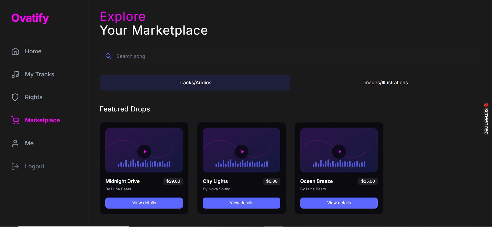

<p align="center">
  
</p>

<h1 align="center">🎵 Ovatify — Your Ultimate Music Platform</h1>

<p align="center">
  A premium music creation and management platform built with Laravel 12
</p>

<p align="center">
  
  
  
  
  
  
</p>

---

## 📖 About Ovatify

**Ovatify** is a modern music creation and management platform that empowers creators to manage their tracks, explore new content, and handle investments and marketplace activities — all wrapped in a **premium, sleek dark-themed interface**.

Whether you're a music creator looking to publish your beats, a consumer searching for the perfect sound, or an investor wanting to fund the next big hit, Ovatify brings it all together in one powerful platform.

---

## ✨ Features

### 🎛️ Creator Dashboard
- Track your **earnings, publishes, and drafts** at a glance
- Manage your music portfolio with real-time stats
- Collaborate with other creators via **Collab Requests**

### 🤖 AI Integration
- Create new tracks using **AI-powered song generation**
- Manage AI tasks and generation sessions
- Smart creative session management with idea tracking

### 🛒 Marketplace
- Explore, buy, and sell music content — **Beats, Vocals, Loops, and more**
- Full **licensing system** with multiple license tiers
- Secure **Stripe-powered payments** for all transactions
- Investment opportunities in marketplace assets

### 🔐 User Authentication
- Secure **sign-up and login** with email verification
- Social login via **Laravel Socialite**
- Email verification flow with verification codes
- Password reset functionality

### 📦 Distribution
- Submit **distribution requests** to DSP platforms (Spotify, Apple Music, etc.)
- Track distribution status and manage DSP integrations

### 💳 Seller & Financials
- Bank account management for sellers
- **Investment distribution** tracking and royalty management
- Detailed transaction history

### 🎨 Premium UI
- Modern **dark mode design** with vibrant accents
- Responsive layout for all screen sizes
- Built with **Tailwind CSS v4** and Blade Templates

---

## 📸 Screenshots

| Home Dashboard | Home Page |
|:--------------:|:---------:|
|  |  |

| Marketplace | My Tracks |
|:-----------:|:---------:|
|  |  |

| Sign Up |
|:-------:|
|  |

---

## 🚀 Getting Started

### Prerequisites

Make sure you have the following installed:

- **PHP** >= 8.2
- **Composer**
- **Node.js** >= 18.x & **npm**
- **MySQL** (or compatible database)

---

### ⚡ Quick Setup (One Command)

```bash
composer run setup
```

This will automatically run:
- `composer install`
- Copy `.env.example` → `.env` and generate app key
- Run migrations
- `npm install` & `npm run build`

---

### 🔧 Manual Installation

**1. Clone the repository**
```bash
git clone https://github.com/YOUR_USERNAME/ovatify.git
cd ovatify
```

**2. Install PHP dependencies**
```bash
composer install
```

**3. Install Node dependencies**
```bash
npm install
```

**4. Environment Setup**
```bash
cp .env.example .env
php artisan key:generate
```

**5. Configure your `.env` file**
```env
DB_CONNECTION=mysql
DB_HOST=127.0.0.1
DB_PORT=3306
DB_DATABASE=ovatify
DB_USERNAME=root
DB_PASSWORD=your_password

# Stripe (for payments)
STRIPE_KEY=your_stripe_publishable_key
STRIPE_SECRET=your_stripe_secret_key

# Mail (for email verification)
MAIL_MAILER=smtp
MAIL_HOST=your_mail_host
MAIL_PORT=587
MAIL_USERNAME=your_email
MAIL_PASSWORD=your_password
```

**6. Run Database Migrations**
```bash
php artisan migrate
```

**7. Build Frontend Assets**
```bash
npm run build
```

**8. Start the Development Server**
```bash
php artisan serve
```

Visit `http://localhost:8000` in your browser 🎉

---

### 🛠 Full Dev Mode (with queue, logs, and Vite HMR)

```bash
composer run dev
```

This runs all services concurrently:
- Laravel server (`php artisan serve`)
- Queue worker (`php artisan queue:listen`)
- Log viewer (`php artisan pail`)
- Vite HMR (`npm run dev`)

---

## 🏗 Tech Stack

| Layer | Technology |
|-------|-----------|
| **Backend** | Laravel 12.x |
| **Frontend** | Blade Templates, Tailwind CSS v4 |
| **Database** | MySQL |
| **Auth** | Laravel Sanctum + Socialite |
| **Payments** | Stripe (stripe-php v19) |
| **Build Tool** | Vite 7 + laravel-vite-plugin |
| **Package Manager** | Composer + npm |
| **Testing** | PHPUnit 11 |

---

## 📁 Project Structure

```
ovatify/
├── app/
│   ├── Http/
│   │   ├── Controllers/
│   │   │   ├── Api/          # REST API controllers
│   │   │   ├── Consumer/     # Consumer-facing controllers
│   │   │   ├── Creator/      # Creator dashboard controllers
│   │   │   ├── Marketplace/  # Marketplace controllers
│   │   │   ├── Stripe/       # Payment controllers
│   │   │   └── Web/          # Web/view controllers
│   │   ├── Middleware/
│   │   └── Requests/
│   ├── Models/               # Eloquent models
│   └── Services/             # Business logic services
├── database/
│   ├── migrations/           # Database schema
│   ├── seeders/              # Database seeders
│   └── factories/            # Model factories
├── resources/
│   └── views/                # Blade templates
├── routes/                   # Route definitions
└── public/                   # Public assets
```

---

## 🧪 Running Tests

```bash
composer run test
# or
php artisan test
```

---

## 📄 License

The Ovatify platform is open-sourced software licensed under the **[MIT License](https://opensource.org/licenses/MIT)**.

---

## 🤝 Contributing

Contributions are welcome! Please feel free to submit a Pull Request.

1. Fork the project
2. Create your feature branch (`git checkout -b feature/AmazingFeature`)
3. Commit your changes (`git commit -m 'Add some AmazingFeature'`)
4. Push to the branch (`git push origin feature/AmazingFeature`)
5. Open a Pull Request

---


